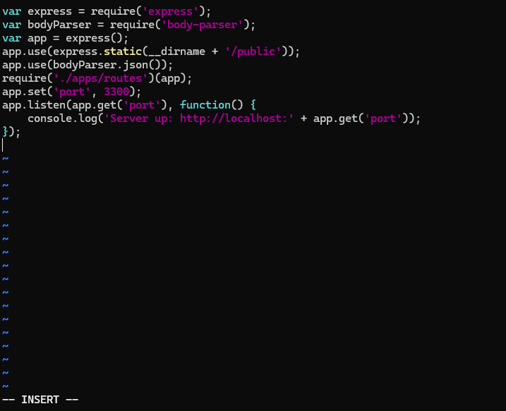
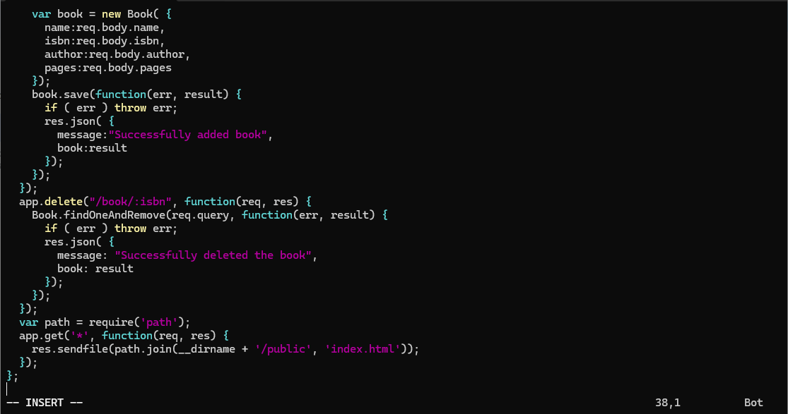
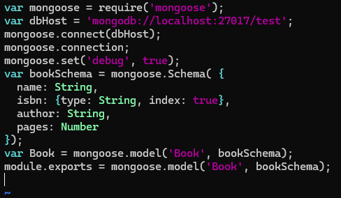
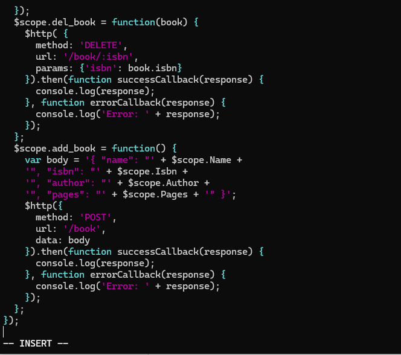
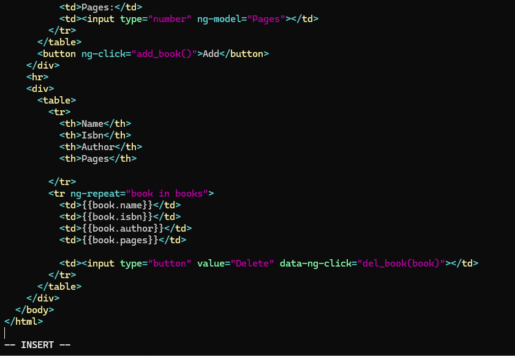
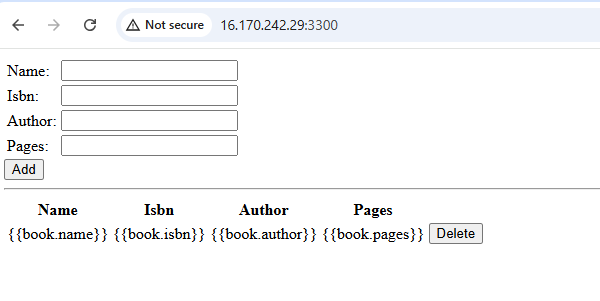

## Kays Documentation of Project 4

### *MEAN STACK DEPLOYMENT TO UBUNTU IN AWS*

### Install NodeJs

Update Ubuntu

`sudo apt update`

Upgrade ubuntu

`sudo apt upgrade`

Add certificates

`sudo apt -y install curl dirmngr apt-transport-https lsb-release ca-certificates`
 
`curl -sL https://deb.nodesource.com/setup_12.x | sudo -E bash -`

Install NodeJS

`sudo apt install -y nodejs`

###  Install MongoDB

MongoDB stores data in flexible, JSON-like documents. Fields in a database can vary from document to document and data structure can be changed over time. For our example application, we are adding book records to MongoDB that contain book name, isbn number, author, and number of pages.
mages/WebConsole.gif

`sudo apt-key adv --keyserver hkp://keyserver.ubuntu.com:80 --recv 0C49F3730359A14518585931BC711F9BA15703C6`

`echo "deb [ arch=amd64 ] https://repo.mongodb.org/apt/ubuntu trusty/mongodb-org/3.4 multiverse" | sudo tee /etc/apt/sources.list.d/mongodb-org-3.4.list`

### Install MongoDB

`sudo apt install -y mongodb`

Start The server

`sudo service mongodb start`

Verify that the service is up and running

`sudo systemctl status mongodb`

Install npm – Node package manager.

`sudo apt install -y npm`

Install body-parser package

`sudo npm install body-parser`

Create a folder named ‘Books’

`mkdir Books && cd Books`

In the Books directory, Initialize npm project

`npm init`
 
Add a file to it named server.js

`vi server.js`

copy and paste the web server code below into the server.js file.

### INSTALL EXPRESS AND SET UP ROUTES TO THE SERVER

*Install Express and set up routes to the server*

`sudo npm install express mongoose`

In ‘Books’ folder, create a folder named apps

`mkdir apps && cd apps`

Create a file named routes.js

`vi routes.js`
 
Copy and paste the code below into routes.js

In the ‘apps’ folder, create a folder named models

`mkdir models && cd models`

Create a file named book.js

`vi book.js`

Copy and paste the code below into ‘book.js’

### Access the routes with AngularJS

Change the directory back to ‘Books’

`cd ../..`

Create a folder named public

`mkdir public && cd public`

Add a file named script.js

`vi script.js`
  
Copy and paste the Code below (controller configuration defined) into the script.js file.

In the public folder, create a file named index.html;

`vi index.html`
  
Copy and paste the code below into index.html file.

Change the directory back up to Books

`cd ..`

Start the server by running this command:

`node server.js`

*The server is now up and running, we can connect it via port 3300. You can launch a separate Putty or SSH console to test what the curl command returns locally.*

`curl -s http://localhost:3300`

*It shall return an HTML page, it is hardly readable in the CLI, but we can also try and access it from the Internet.*

For this – you need to open TCP port 3300 in your AWS Web Console for your EC2 Instance.

Now you can access our Book Register web application from the Internet with a browser using a Public IP address or Public DNS name.

This is how your WebBook Register Application will look in the browser:

